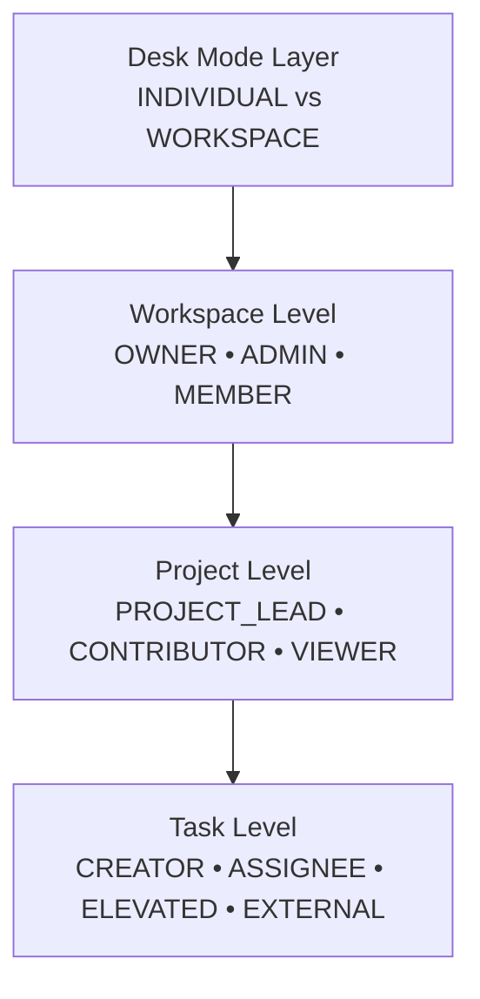

# Role-Based Access Control (RBAC) Architecture

This document outlines the Role-Based Access Control (RBAC) structure implemented across the Collaborate platform.

---

## 1. Overview & Hierarchy

Collaborate implements a **multi-tiered, hierarchical access control model** that spans four distinct layers:



### Key Principles

1. **Downward Inheritance (Elevation)**:
   - Workspace **Owners** and **Admins** automatically inherit elevated administrative authority across all projects and tasks within the workspace, regardless of explicit project membership.
   - **Project Leads** (and the project creator) inherit elevated management privileges across all tasks housed within that project.
2. **Context-Aware Scoping**:
   - A user's privileges inside a project or task are determined dynamically by combining their workspace role, their project role, and their direct entity association (creator or assignee).
3. **Strict Containment**:
   - Sensitive collaborative actions (such as commenting on tasks or modifying task properties) enforce containment to prevent external workspace members from interfering with ongoing work.

---

## 2. Desk Mode (`DeskMode`)

Every workspace is provisioned under one of two operating modes defined in `DeskMode`:

| Desk Mode | Target Audience | Capabilities & Scope | UI Navigation Scope |
| :--- | :--- | :--- | :--- |
| `INDIVIDUAL` | Solo professionals / freelancers | Personal task and project tracking. No team collaboration, join requests, or member invites allowed. | `PROTECTEDPERSONALNAVBAR`<br/>(Dashboard, Projects, Tasks, Calendar, Settings) |
| `WORKSPACE` | Teams and organizations | Full multi-member collaboration with hierarchical permissions, role assignments, teams, join requests, and audit logs. | `PROTECTEADMINNAVBAR` (Owners/Admins)<br/>`PROTECTEDMEMBERNAVBAR` (Members) |

---

## 3. Workspace-Level Roles (`WorkspaceRoles`)

Workspace roles govern administrative authority over the workspace container, member management, onboarding, and organization-wide resources.

### Role Definitions

- **`OWNER`**:
  - The creator and primary custodian of the workspace.
  - Possesses non-revocable, full administrative authority over the entire workspace.
  - **Immobility Rule**: Cannot be demoted, modified, or removed by any other user (including other Admins).
- **`ADMIN`**:
  - Delegated administrator assisting the Owner.
  - Can access and configure workspace settings (name, industry type, team preferences, and metadata).
  - Can manage workspace membership (promoting/demoting between `MEMBER` and `ADMIN`, activating/deactivating members, removing members).
  - Can review and approve join requests and generate invite codes.
  - Inherits elevated privileges across all workspace projects and tasks.
- **`MEMBER`**:
  - Standard collaborator within the workspace.
  - Can participate in public projects or private projects they have been assigned to.
  - Read-only visibility into the workspace member directory; cannot access administrative routes or workspace configuration settings (restricted to personal profile settings).

### Workspace Permissions Matrix

| Capability / Action | OWNER | ADMIN | MEMBER |
| :--- | :---: | :---: | :---: |
| **Workspace Settings & Configuration**<br/>*(General metadata, preferences, industry type)* | ✅ Full | ✅ | ❌ |
| **Workspace Deletion & Ownership Transfer** | ✅ | ❌ | ❌ |
| **Manage Billing & Plan (if applicable)** | ✅ Full | ❌ | ❌ |
| **Invite Members & Generate Invite Codes** | ✅ | ✅ | ❌ |
| **Approve / Reject Join Requests** | ✅ | ✅ | ❌ |
| **Change Member Roles (`MEMBER` &harr; `ADMIN`)** | ✅ | ✅ *(excl. Owner)* | ❌ |
| **Update Member Status (`ACTIVE` &harr; `INACTIVE`)** | ✅ | ✅ *(excl. Owner)* | ❌ |
| **Remove Member from Workspace** | ✅ | ✅ *(excl. Owner)* | ❌ |
| **Create Teams & Manage Team Assignments** | ✅ | ✅ | ❌ |
| **View Audit / Activity Feeds (`/activity`)** | ✅ | ✅ | ❌ |
| **View Workspace Member Directory (`/members`)** | ✅ | ✅ | ✅ *(View only)* |
| **Create Projects & Tasks** | ✅ | ✅ | ✅ |

### Member Status (`MemberStatus`)

- **`ACTIVE`**: Full operational access corresponding to assigned workspace role.
- **`INACTIVE`**: Account is suspended/deactivated within the workspace; write operations and session authorizations are revoked or restricted.

---

## 4. Project-Level Access (`ProjectAccess` & `ProjectVisibility`)

Projects act as collaborative hubs that hold tasks, milestones, comments, resources, and activity feeds.

### Project Roles (`ProjectAccess`)

- **`PROJECT_LEAD`**: The designated manager for the project. Responsible for project settings, timeline, member roster, and task assignment.
- **`CONTRIBUTOR`**: Active team member. Can create tasks, add resources, and post discussions.
- **`VIEWER`**: Read-only stakeholder. Can inspect tasks, milestones, and resources without edit or comment capabilities.

### Project Visibility (`ProjectVisibility`)

- **`PUBLIC`**: Visible to all active members of the workspace.
- **`PRIVATE`**: Visible only to assigned project members (`ProjectMember`) and Workspace Administrators (`OWNER`, `ADMIN`).

### Project Elevation Logic (`isProjectElevated`)

A user is considered **Elevated** on a project if:
$$\text{isProjectElevated} = \text{isWorkspaceAdmin} \lor \text{isProjectLead} \lor \text{isProjectCreator}$$

Where:
- $\text{isWorkspaceAdmin}$: Workspace role is `OWNER` or `ADMIN`.
- $\text{isProjectLead}$: Project role is `PROJECT_LEAD`.
- $\text{isProjectCreator}$: Member is the original creator (`project.createdById === member.id`).

### Project Permissions Matrix

| Capability | Elevated<br/>*(Admin / Lead / Creator)* | Contributor | Viewer | External Member<br/>*(Public Project)* |
| :--- | :---: | :---: | :---: | :---: |
| **View Project Overview & Details** | ✅ | ✅ | ✅ | ✅ |
| **Configure Project Metadata**<br/>*(Title, Description, Dates, Priority, Status, Labels)* | ✅ | ❌ | ❌ | ❌ |
| **Manage Project Members**<br/>*(Assign/Remove members, assign Project Lead)* | ✅ | ❌ | ❌ | ❌ |
| **Delete Project** | ✅ | ❌ | ❌ | ❌ |
| **Create Tasks** | ✅ | ✅ | ❌ | ❌ |
| **Manage Project Resources**<br/>*(Add / remove links and files)* | ✅ | ✅ | ❌ | ❌ |
| **Comment on Project Overview** | ✅ | ✅ | ❌ | ❌ |

---

## 5. Task-Level Access (`computeTaskAccess`)

Tasks belong to a specific Project and Workspace. Collaborate enforces fine-grained task permissions based on direct task affiliation and project elevation.

### User Task Affiliation States

- **Elevated Manager**: Workspace Admin (`OWNER`/`ADMIN`) or Project Lead (`PROJECT_LEAD`).
- **Inside Task**: The user is the **Task Creator** (`task.createdById === member.id`) or an **Assigned Task Member** (`taskMembers.some(tm => tm.memberId === member.id)`).
- **External Project Member**: A project contributor or viewer who is neither creator nor assigned to the task.

### Task Permissions Matrix

| Capability | Elevated Manager<br/>*(Admin / Project Lead)* | Task Creator | Assigned Task Member | External Contributor / Viewer |
| :--- | :---: | :---: | :---: | :---: |
| **View Task Details** | ✅ | ✅ | ✅ | ✅ *(if project visible)* |
| **Edit Task Metadata**<br/>*(Title, description, dates, priority, status, labels)* | ✅ | ✅ | ✅ | ❌ |
| **Post Comments & Replies on Task** | ✅ | ✅ | ✅ | ❌ |
| **Manage Task Assignees** | ✅ | ✅ | ❌ | ❌ |
| **Delete Task** | ✅ | ✅ | ❌ | ❌ |
| **Add / Delete Task Resources** | ✅ | ✅ | ✅ | ❌ |
| **Create / Manage Milestones** | ✅ | ✅ | ✅ | ❌ |
| **Complete Milestones** | ✅ | ✅ | ✅ | ❌ |

> [!IMPORTANT]
> **Task Comment Containment Rule**:
> Workspace members who are not assigned to a task, did not create the task, or are not elevated managers cannot post comments on that task. This prevents unassigned noise and ensures structured discussion among task owners.

---

## 6. Onboarding, Join Requests & Invitations

Access to a workspace is protected at entry through two mechanisms:

### Invite Codes (`inviteCode`)

- Generated by Workspace `OWNER` or `ADMIN`.
- Types:
  - **`OPEN`**: Reusable code valid for any user possessing the code until expiration (`timeLimit`).
  - **`RESERVED`**: Designated for a specific email or user (`reservedFor`).
- Tracked back to the inviting member (`memberId`).

### Join Requests (`JoinRequest`)

- Unauthenticated or non-member users submit a request specifying their email, name, workspace ID, optional message, and optional invite code.
- Status Lifecycle:
  - **`PENDING`**: Request submitted and awaiting review.
  - **`ACCEPTED`**: Approved by a Workspace Admin/Owner (`reviewedById`, `reviewedAt`), automatically enrolling the user with the `MEMBER` role.

---

## 7. Implementation & Code Reference

The RBAC structure is codified across the following modules:

| Component | Source File | Responsibility |
| :--- | :--- | :--- |
| **Schema & Enums** | [`prisma/schema.prisma`](file:///prisma/schema.prisma) | Canonical definition of `WorkspaceRoles`, `ProjectAccess`, `ProjectVisibility`, `DeskMode`, `MemberStatus`, `RequestStatus`. |
| **Project Permissions** | [`src/lib/permissions/project-permissions.ts`](file:///src/lib/permissions/project-permissions.ts) | Pure calculation function `computeProjectAccess` determining project authorization flags. |
| **Task Permissions** | [`src/lib/permissions/task-permissions.ts`](file:///src/lib/permissions/task-permissions.ts) | Pure calculation function `computeTaskAccess` determining task authorization flags. |
| **Member Management** | [`src/lib/services/member.services.ts`](file:///src/lib/services/member.services.ts) | Server actions for role mutations, status toggling, and member removals with Owner safeguards. |
| **Project Service** | [`src/lib/services/project.services.ts`](file:///src/lib/services/project.services.ts) | Access validation middleware functions: `resolveProjectMemberAndAccess` and `checkProjectEditPermission`. |
| **Task Service** | [`src/lib/services/task.services.ts`](file:///src/lib/services/task.services.ts) | Access validation helper `resolveTaskMemberAndAccess` ensuring task edits, comments, and deletions obey access rules. |
| **Navigation Helpers** | [`src/lib/utils.ts`](file:///src/lib/utils.ts) & [`src/lib/const.ts`](file:///src/lib/const.ts) | `renderNavigationByRole` dynamic sidebar navigation routing based on role and desk mode. |

### Example Usage in Server Actions

```typescript
// Checking project access in a Server Action
const resolved = await resolveProjectMemberAndAccess(userId, workspaceId, projectId);
if (!resolved || !resolved.access.canConfigureProject) {
    return { success: false, message: "Unauthorized: Insufficient project permissions" };
}

// Checking task access in a Server Action
const resolvedTask = await resolveTaskMemberAndAccess(taskId, userId, workspaceId);
if (!resolvedTask || !resolvedTask.access.canEditTask) {
    return { success: false, message: "Unauthorized: You cannot edit this task" };
}
```
