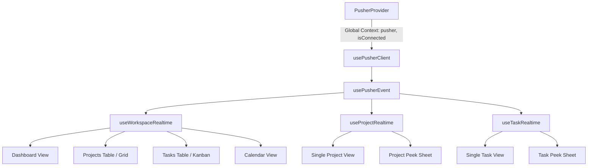
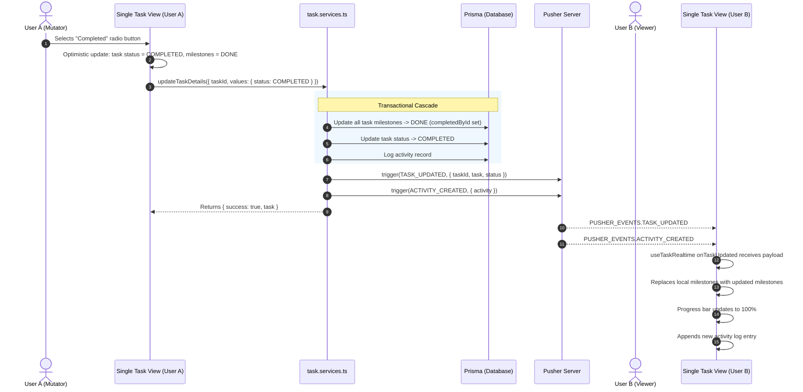
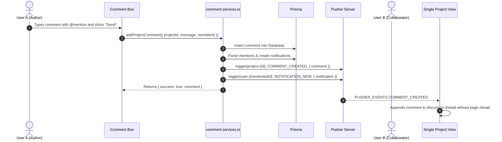
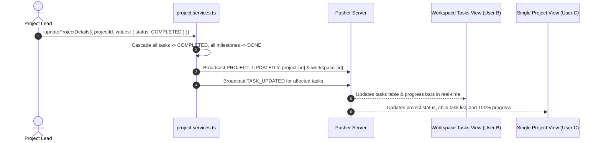

# Real-Time Update Flow & Architecture

This document provides a comprehensive technical reference for the real-time synchronization system implemented across Collaborate using [Pusher Channels](https://pusher.com/channels) (WebSockets). It details channel topologies, event schemas, server-side broadcasting triggers, client-side subscription hooks, optimistic updates, and end-to-end event flows.

---

## 1. Architectural Overview

Collaborate employs a **multi-tiered event-driven pub/sub architecture** that guarantees instant bi-directional state synchronization between distributed team members.

```mermaid
graph TD
    subgraph Client Layer
        A[User Action / Mutation] -->|1. Optimistic Update| UI[Client Component State]
        A -->|2. Server Action Request| SA[Next.js Server Action]
    end

    subgraph Server Layer
        SA -->|3. Database Transaction| DB[(PostgreSQL / Prisma)]
        SA -->|4. Trigger Event| PS[Pusher Server Instance]
    end

    subgraph Pusher Network
        PS -->|5. WebSocket Publish| PC[Pusher Cloud Service]
    end

    subgraph Client Subscriptions
        PC -->|6. Broadcast Event| CH_WS[Workspace Channel<br/>workspace-{id}]
        PC -->|6. Broadcast Event| CH_PR[Project Channel<br/>project-{id}]
        PC -->|6. Broadcast Event| CH_TK[Task Channel<br/>task-{id}]
        PC -->|6. Broadcast Event| CH_US[User Channel<br/>user-{id}]
    end

    subgraph Connected Clients
        CH_WS -->|7. Dispatched to Listeners| H_WS[useWorkspaceRealtime]
        CH_PR -->|7. Dispatched to Listeners| H_PR[useProjectRealtime]
        CH_TK -->|7. Dispatched to Listeners| H_TK[useTaskRealtime]
        CH_US -->|7. Notification / Presence| H_US[PusherProvider]
        H_WS -->|8. Sync State| UI2[Connected Users' UI]
        H_PR -->|8. Sync State| UI2
        H_TK -->|8. Sync State| UI2
        H_US -->|8. Push Notification| UI2
    end
```

### Core Tenets
1. **Multi-Channel Granularity**: Channel scopes prevent information leaks and ensure clients receive only relevant updates for their current view.
2. **Optimistic UI with Fallback**: Mutating clients update local state instantly for zero-latency interactions; server reconciliation ensures consistent data across all clients.
3. **Cascading Event Propagation**: High-level actions (e.g., completing a project or task) automatically trigger synchronized cascading events across related entities.
4. **Resilient Singleton Management**: Pusher server and client connections are managed via singleton instances with automatic reconnection and channel clean-up on unmount.

---

## 2. Channel Naming & Topology

Channels are formatted using deterministic string identifiers defined in `src/lib/pusher/events.ts`:

| Channel Type | Generator Function | Format / Pattern | Scope & Purpose |
| :--- | :--- | :--- | :--- |
| **Workspace** | `getWorkspaceChannel(workspaceId)` | `workspace-{workspaceId}` | Broadcasts workspace-wide changes: entity creation/deletion, member role modifications, dashboard metrics. |
| **Project** | `getProjectChannel(projectId)` | `project-{projectId}` | Scoped to a specific project: project metadata, tasks added/updated within the project, comments, resources, project members. |
| **Task** | `getTaskChannel(taskId)` | `task-{taskId}` | Scoped to a specific task: task metadata, milestones created/updated/deleted, comments, assignees, resources. |
| **User** | `getUserChannel(userId)` | `user-{userId}` | Personal channel for direct notifications, assignments, and alerts directed at a specific user. |
| **Private Workspace** | `getPrivateWorkspaceChannel(workspaceId)` | `private-workspace-{workspaceId}` | Authenticated channel for sensitive workspace communications. |
| **Presence Workspace** | `getPresenceWorkspaceChannel(workspaceId)` | `presence-workspace-{workspaceId}` | Tracks active team member presence (who is online/offline). |

---

## 3. Event Names & Payloads

All event names are defined in the `PUSHER_EVENTS` dictionary in `src/lib/pusher/events.ts`:

### A. Workspace Events

| Event Constant | Channel | Triggered When | Payload Schema |
| :--- | :--- | :--- | :--- |
| `WORKSPACE_UPDATED` | Workspace | Workspace settings, name, or metadata are updated | `{ workspaceId, updates }` |
| `WORKSPACE_MEMBER_JOINED` | Workspace | A new member joins the workspace | `{ memberId, member: MemberWithUser }` |
| `WORKSPACE_MEMBER_LEFT` | Workspace | A member is removed or leaves the workspace | `{ memberId }` |
| `WORKSPACE_MEMBER_ROLE_UPDATED` | Workspace | A member's workspace role is changed (`OWNER`, `ADMIN`, `MEMBER`) | `{ memberId, role: WorkspaceRoles }` |

### B. Project Events

| Event Constant | Channels Broadcast To | Triggered When | Payload Schema |
| :--- | :--- | :--- | :--- |
| `PROJECT_CREATED` | Workspace | New project is created | `{ project: ProjectWithDetails, projectId }` |
| `PROJECT_UPDATED` | Workspace & Project | Project metadata, status, priority, or dates are modified | `{ projectId, workspaceId, updates, project, tasks? }` |
| `PROJECT_DELETED` | Workspace & Project | A project is deleted | `{ projectId }` |

### C. Task Events

| Event Constant | Channels Broadcast To | Triggered When | Payload Schema |
| :--- | :--- | :--- | :--- |
| `TASK_CREATED` | Workspace, Project | New task is created | `{ task: TaskWithDetails, taskId }` |
| `TASK_UPDATED` | Workspace, Project, Task | Task status, dates, priority, title, or description changes | `{ taskId, workspaceId, updates, task, status }` |
| `TASK_DELETED` | Workspace, Project, Task | A task is removed | `{ taskId, projectId? }` |
| `TASK_STATUS_CHANGED` | Project, Task | Explicit status transitions | `{ taskId, status: Status, previousStatus: Status }` |

### D. Milestone Events

| Event Constant | Channels Broadcast To | Triggered When | Payload Schema |
| :--- | :--- | :--- | :--- |
| `MILESTONE_CREATED` | Task | A milestone is added to a task | `{ taskId, milestone: MileStone }` |
| `MILESTONE_UPDATED` | Task | A milestone is checked/unchecked or edited | `{ taskId, milestoneId, milestone, taskStatus? }` |
| `MILESTONE_DELETED` | Task | A milestone is deleted | `{ taskId, milestoneId }` |

### E. Comment & Resource Events

| Event Constant | Channels Broadcast To | Triggered When | Payload Schema |
| :--- | :--- | :--- | :--- |
| `COMMENT_CREATED` | Project or Task | A comment or reply is posted | `{ comment: CommentWithAuthor }` |
| `COMMENT_UPDATED` | Project or Task | A comment is edited | `{ commentId, message, comment }` |
| `COMMENT_DELETED` | Project or Task | A comment or thread is deleted | `{ commentId }` |
| `RESOURCE_ADDED` | Project or Task | An attachment or external link is added | `{ resourceId, resource, projectId?, taskId? }` |
| `RESOURCE_UPDATED` | Project or Task | A resource is renamed or modified | `{ resourceId, resource }` |
| `RESOURCE_DELETED` | Project or Task | A resource is removed | `{ resourceId }` |
| `MEMBERS_UPDATED` | Project or Task | Assignees or project leads are updated | `{ memberIds, leadId?, projectMembers?, taskMembers? }` |

### F. Activity & Notifications

| Event Constant | Channels Broadcast To | Triggered When | Payload Schema |
| :--- | :--- | :--- | :--- |
| `ACTIVITY_CREATED` | Workspace, Project, or Task | An audit log entry is generated | `{ activity: ActivityWithMember }` |
| `NOTIFICATION_NEW` | User Channel (`user-{id}`) | A personal notification is dispatched | `{ notification: NotificationRecord }` |

---

## 4. Server-Side Broadcasting Implementation

Server-side event triggers use `triggerPusherEvent` from `src/lib/pusher/server.ts`.

### Safe Server Trigger Utility
```typescript
import Pusher from "pusher";
import { PusherEventType } from "./events";

export async function triggerPusherEvent<T = unknown>(
    channel: string | string[],
    event: PusherEventType | string,
    data: T
): Promise<boolean> {
    try {
        const pusher = getPusherServer();
        if (!pusher) return false;
        await pusher.trigger(channel, event, data);
        return true;
    } catch (error) {
        console.error(`[Pusher Server] Failed to trigger event "${event}" on channel "${channel}":`, error);
        return false;
    }
}
```

### Multi-Channel Dual Broadcasting
Many actions trigger events across multiple channel tiers simultaneously to keep aggregate views (like project tables or dashboards) and detail views synchronized:

```typescript
// Example from task.services.ts: Broadcasting to both task and workspace channels
await triggerPusherEvent(
    [
        PUSHER_CHANNELS.getTaskChannel(taskId), 
        PUSHER_CHANNELS.getWorkspaceChannel(existingTask.workspaceId)
    ],
    PUSHER_EVENTS.TASK_UPDATED,
    { taskId, updates: values, task: updatedTask, status: updatedTask.status }
);
```

---

## 5. Client-Side Subscription & Hooks

Collaborate abstracts Pusher subscriptions into clean React hooks in `src/hooks/use-pusher.ts`:



### 1. `PusherProvider` (`pusher-provider.tsx`)
Initializes the client connection once at the root layout and automatically handles user and workspace channel subscriptions:
- Automatically subscribes to `user-{userId}` for personal alerts.
- Automatically subscribes to `workspace-{currentWorkspaceId}` for workspace events.
- Cleans up subscriptions on workspace change or user sign-out.

### 2. `usePusherEvent<T>` (Base Hook)
A memory-safe hook that registers an event listener, keeps handler references current using `useRef`, and automatically unbinds upon component unmount:
```typescript
export function usePusherEvent<T = unknown>(
    channelName: string | null | undefined,
    eventName: string,
    handler: (data: T) => void
) {
    const { pusher } = usePusher();
    const handlerRef = useRef(handler);
    handlerRef.current = handler;

    useEffect(() => {
        if (!pusher || !channelName || !eventName) return;
        const channel = pusher.subscribe(channelName);
        const eventListener = (data: any) => handlerRef.current?.(data);

        channel.bind(eventName, eventListener);
        return () => {
            channel.unbind(eventName, eventListener);
        };
    }, [pusher, channelName, eventName]);
}
```

### 3. Convenience Domain Hooks

#### A. `useWorkspaceRealtime(workspaceId, callbacks)`
Listens on `workspace-{workspaceId}` for:
- `onActivityCreated`
- `onTaskCreated`, `onTaskUpdated`, `onTaskDeleted`
- `onProjectCreated`, `onProjectUpdated`, `onProjectDeleted`
- `onMemberJoined`

#### B. `useProjectRealtime(projectId, callbacks)`
Listens on `project-{projectId}` for:
- `onProjectUpdated`, `onActivityCreated`
- `onCommentCreated`, `onCommentUpdated`, `onCommentDeleted`
- `onResourceAdded`, `onResourceUpdated`, `onResourceDeleted`
- `onMembersUpdated`
- `onTaskCreated`, `onTaskUpdated`, `onTaskDeleted`

#### C. `useTaskRealtime(taskId, callbacks)`
Listens on `task-{taskId}` for:
- `onTaskUpdated`, `onActivityCreated`
- `onCommentCreated`, `onCommentUpdated`, `onCommentDeleted`
- `onMilestoneCreated`, `onMilestoneUpdated`, `onMilestoneDeleted`
- `onResourceAdded`, `onResourceUpdated`, `onResourceDeleted`
- `onMembersUpdated`

---

## 6. End-to-End Real-Time Flows

### Flow 1: Task Status Change & Milestone Cascading

When User A marks a task as Completed or moves it back to In Progress:



### Flow 2: Live Commenting & Replies



### Flow 3: Project Status Cascading to Tasks & Milestones



---

## 7. Optimistic UI Updates & Error Rollback Pattern

To ensure instantaneous feedback, client components follow the **Optimistic Update Pattern**:

```typescript
const handleUpdateStatus = async (nextStatus: Status) => {
    if (nextStatus === status) return;
    const previousStatus = status;
    const previousMilestones = task.milestones;

    // 1. Instant Optimistic State Update
    setStatus(nextStatus);
    setTask((prev) => ({
        ...prev,
        status: nextStatus,
        milestones: nextStatus === Status.COMPLETED 
            ? prev.milestones?.map((m) => ({ ...m, status: MileStoneStatus.DONE }))
            : prev.milestones?.map((m) => ({ ...m, status: MileStoneStatus.NOT_STARTED })),
    }));

    // 2. Dispatch Server Mutation
    const res = await updateTaskDetails({
        taskId: task.id,
        values: { status: nextStatus },
        memberId: currentMember?.id,
    });

    // 3. Rollback on Failure or Reconcile with Server State
    if (!res.success) {
        setStatus(previousStatus);
        setTask((prev) => ({
            ...prev,
            status: previousStatus,
            milestones: previousMilestones,
        }));
        toast.error(res.message || "Failed to update status");
    } else {
        // Reconcile with verified server payload
        if (res.task) {
            setTask((prev) => ({ ...prev, ...(res.task as any) }));
        }
        toast.success(`Status updated to ${formatStatus(nextStatus)}`);
    }
};
```

---

## 8. Troubleshooting & Best Practices

### Environment Configuration
Ensure all required environment keys are present in `.env`:
```ini
# Pusher Server (Private)
PUSHER_APP_ID="your-app-id"
PUSHER_KEY="your-pusher-key"
PUSHER_SECRET="your-pusher-secret"
PUSHER_CLUSTER="your-cluster"

# Pusher Client (Public)
NEXT_PUBLIC_PUSHER_KEY="your-pusher-key"
NEXT_PUBLIC_PUSHER_CLUSTER="your-cluster"
```

### Common Issues & Diagnostic Steps

| Issue | Likely Cause | Solution |
| :--- | :--- | :--- |
| **Updates not showing in real-time** | Missing or mismatched channel name | Verify that the component's `useTaskRealtime(taskId)` uses the exact ID that matches the server's `getTaskChannel(taskId)`. |
| **Duplicate comments or events** | Component re-rendered and re-bound handler without unbinding | Ensure `usePusherEvent` is used, which encapsulates automatic cleanup on unmount. |
| **Status updates missing milestone changes** | Backend didn't return updated milestones | Ensure `db.task.update` or queries include `milestones: true` and pass them into the `TASK_UPDATED` event payload. |
| **Pusher client disconnected** | Invalid API keys or cluster configuration | Check browser console for `[Pusher Client]` warnings; inspect network tab for WebSocket handshake. |
