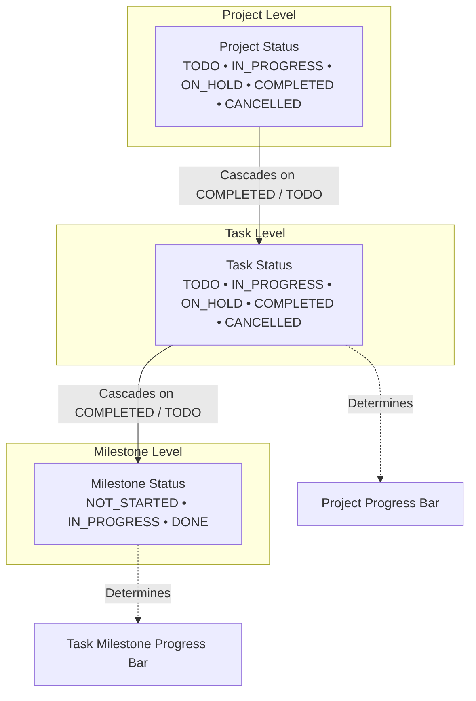
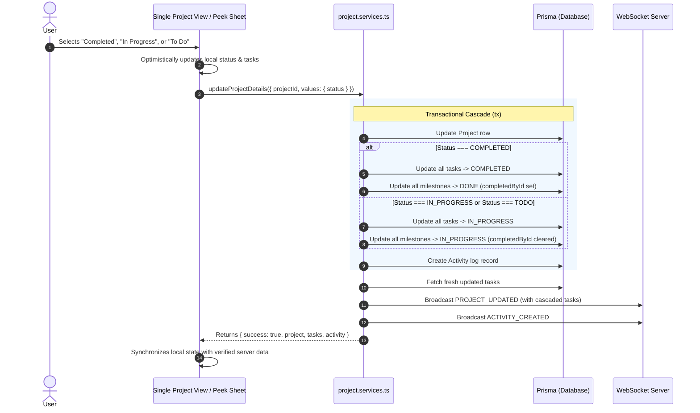
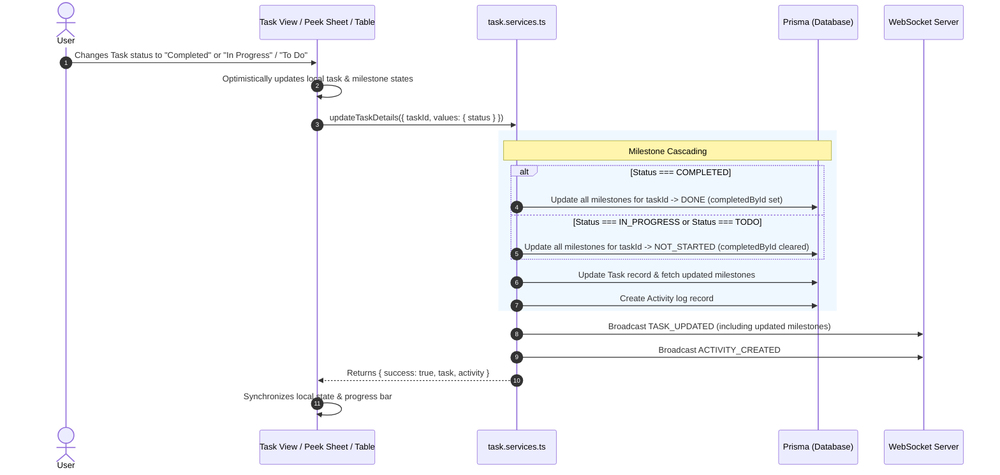

# Project, Task, and Milestone Updates: Manual & Automated Lifecycle

This document provides a comprehensive reference on how **Projects**, **Tasks**, and **Milestones** are created, modified, and synchronized across Collaborate. It details both manual user interactions and automated system cascading, progress calculations, permission constraints, and real-time event broadcasting.

---

## 1. Overview & Data Enums

The core work-tracking entities in Collaborate have discrete lifecycle states governed by Prisma enums:

### Enums

| Entity | Enum Name | Values |
| :--- | :--- | :--- |
| **Project** | `Status` | `TODO`, `IN_PROGRESS`, `ON_HOLD`, `COMPLETED`, `CANCELLED` |
| **Task** | `Status` | `TODO`, `IN_PROGRESS`, `ON_HOLD`, `COMPLETED`, `CANCELLED` |
| **Milestone** | `MileStoneStatus` | `NOT_STARTED`, `IN_PROGRESS`, `DONE` |
| **Priority** | `PriorityLevel` | `URGENT`, `HIGH`, `MEDIUM`, `LOW`, `NO_PRIORITY` |



---

## 2. Manual Updates

Users can manually update projects, tasks, and milestones through multiple interactive interfaces across the platform.

### A. Project Updates

| Surface | Editable Fields | Permission Required | Mechanism |
| :--- | :--- | :--- | :--- |
| **Single Project View** (`/projects/[id]`) | Status | `canConfigureProject` | Interactive radio buttons in the right sidebar. |
| | Title | `canConfigureProject` | Inline editable heading with enter/blur auto-save. |
| | Description | `canConfigureProject` | Rich WYSIWYG editor with formatting controls. |
| | Priority | `canConfigureProject` | Pill dropdown selector with color-coded badges. |
| | Start & Due Dates | `canConfigureProject` | Popover calendar date-pickers. |
| | Project Lead | `canManageMembers` | Dropdown selector searching workspace members. |
| | Contributors | `canManageMembers` | Multi-select member checklist popover. |
| | Labels | `canConfigureProject` | Popover label creator and remover pills. |
| | Resources | `canManageResources` | Add/delete links and reference documents. |
| **Project Peek Sheet** | Status, Priority, Timeline, Members, Resources | `canConfigureProject` | Slide-over drawer with quick properties grid. |
| **Project Table** | Status, Priority, Lead, Dates | `canConfigureProject` | Inline row dropdown menus and bulk action bar. |

> [!NOTE]
> **Who has `canConfigureProject`?**
> Workspace `OWNER`s, workspace `ADMIN`s, the designated `PROJECT_LEAD`, and the original project creator.

### B. Task Updates

| Surface | Editable Fields | Permission Required | Mechanism |
| :--- | :--- | :--- | :--- |
| **Single Task View** (`/tasks/[id]`) | Status | `canEditTask` | Interactive radio buttons in the right sidebar. |
| | Title | `canEditTask` | Inline editable heading with enter/blur auto-save. |
| | Description | `canEditTask` | Expandable description card with editable textarea. |
| | Priority | `canEditTask` | Pill dropdown selector with color-coded badges. |
| | Start & Due Dates | `canEditTask` | Popover calendar date-range pickers. |
| | Assignees | `canManageMembers` | Multi-select member checklist popover. |
| | Labels | `canEditTask` | Popover label creator and remover pills. |
| | Resources | `canEditTask` | Add/delete links and reference documents. |
| **Task Peek Sheet** | Status, Priority, Timeline, Assignees, Milestones | `canEditTask` | Slide-over drawer with quick properties grid. |
| **Task Table** | Status, Priority, Dates | `canEditTask` | Inline row dropdown menus and bulk action bar. |

> [!NOTE]
> **Who has `canEditTask`?**
> Workspace `OWNER`s, workspace `ADMIN`s, the parent project's `PROJECT_LEAD`, the task's creator, and assigned task members.

### C. Milestone Updates

Milestones represent granular checkpoints contained within individual tasks:

- **Checklist Toggle**: Clicking the checkbox beside a milestone in the Single Task View or Task Peek Sheet toggles its status between `DONE` and `NOT_STARTED` (or `IN_PROGRESS`).
- **Completion Tracking**: Toggling a milestone to `DONE` automatically records `completedById` referencing the acting member.
- **Creation & Management**: Task members and leads can add milestones specifying title, description, and an optional due date.

---

## 3. Automated & Cascading Updates

To maintain consistency and eliminate repetitive manual edits across large projects, status transitions trigger automated cascading logic.

### A. Project Status Cascading

When a project's status is changed via `updateProjectDetails`, the server applies transactional cascades across child tasks and milestones:



#### 1. When a Project is Marked as `COMPLETED`:
- **All Child Tasks**: Automatically updated to `Status.COMPLETED`.
- **All Child Milestones**: Automatically updated to `MileStoneStatus.DONE` (with `completedById` recorded).
- **Project Progress Bar**: Automatically displays **100%** across the Single Project View, Project Peek Sheet, and Project Table.
- **Audit Activity Log**: An activity entry is created documenting that the project, along with all associated tasks and milestones, was marked as completed.

#### 2. When a Project is Marked as `IN_PROGRESS` or `TODO`:
- **All Child Tasks**: Automatically updated to `Status.IN_PROGRESS` (reopening work).
- **All Child Milestones**: Automatically updated to `MileStoneStatus.IN_PROGRESS` (with `completedById` cleared).
- **Project Progress Bar**: Automatically recalculates to reflect active progress.
- **Audit Activity Log**: An activity entry is created documenting that the project and its tasks/milestones were transitioned to in progress.

### B. Task Status Cascading to Milestones

When a task's status is changed via `updateTaskDetails` (from the Single Task View, Task Peek Sheet, or Task Table), the server automatically cascades milestone statuses:



#### 1. When a Task is Marked as `COMPLETED`:
- **All Child Milestones**: Automatically updated to `MileStoneStatus.DONE`.
- **Milestone Completer**: `completedById` is assigned to the current acting user's member ID.
- **Task Milestone Progress Bar**: Automatically displays **100%** (all milestones completed).

#### 2. When a Task is Marked as `IN_PROGRESS` or `TODO`:
- **All Child Milestones**: Automatically updated to `MileStoneStatus.NOT_STARTED` ("to do").
- **Milestone Completer**: `completedById` is reset to `null`.
- **Task Milestone Progress Bar**: Recalculates to reflect active progress.

---

## 4. Progress Bar Calculations

Progress bars across the platform are driven by real-time entity state calculations:

### A. Project Progress

#### 1. Single Project View (`single-project-view.tsx`):
```typescript
const completedTasksCount = tasks.filter((t) => t.status === Status.COMPLETED).length;

const calculatedProgress =
  status === Status.COMPLETED
    ? 100
    : tasks.length > 0
    ? Math.round((completedTasksCount / tasks.length) * 100)
    : 0;
```
- When `status === Status.COMPLETED`: Evaluates to **`100%`** unconditionally (even if a project has zero tasks).
- When tasks exist: Ratio of completed tasks to total tasks.
- When no tasks exist and not completed: Evaluates to **`0%`**.

#### 2. Project Peek Sheet & Table (`project-peek-sheet.tsx`, `project-table.tsx`):
Weighted calculation incorporating task milestone completion:
```typescript
export const computeProjectProgress = (p: Projects): number => {
  if (p.status === Status.COMPLETED) return 100;
  const totalTasks = p.tasks?.length || 0;
  if (totalTasks > 0) {
    const totalTaskProgressSum = p.tasks.reduce((acc, t) => {
      const totalMilestones = t.milestones?.length || 0;
      if (totalMilestones > 0) {
        const doneMilestones =
          t.milestones?.filter((m) => m.status === "DONE").length || 0;
        return acc + (doneMilestones / totalMilestones) * 100;
      }
      if (t.status === Status.COMPLETED) return acc + 100;
      if (t.status === Status.IN_PROGRESS) return acc + 50;
      return acc;
    }, 0);
    return Math.round(totalTaskProgressSum / totalTasks);
  }
  return 0;
};
```

### B. Task Milestone Progress (`task-peek-sheet.tsx`, `single-task-view.tsx`)

Milestone checklist completion percentage:
```typescript
const completedMilestones = milestones.filter((m) => m.status === MileStoneStatus.DONE).length;
const totalMilestones = milestones.length;

const milestonePercent =
  totalMilestones > 0
    ? Math.round((completedMilestones / totalMilestones) * 100)
    : 0;
```

---

## 5. Permissions & Disabled State Handling

If a user lacks permission to modify a project or task, status controls strictly prevent unauthorized edits while providing visual cues:

### Disabled Status Radio Buttons
In both the **Single Project View** and **Single Task View** right sidebars:
- **Button Container**: Rendered with `opacity-60 cursor-not-allowed select-none`, disabling hover effects.
- **HTML Disabled Attribute**: `disabled={!canEditProject || isSavingStatus}` natively blocks mouse and keyboard interactions.
- **Tooltip**: Displays a descriptive tooltip on hover:
  - Project: *"You do not have permission to edit this project's status"*
  - Task: *"You do not have permission to edit this task's status"*
- **Server Guard**: All backend Server Actions (`updateProjectDetails`, `updateTaskDetails`) independently verify permissions against the database, rejecting unauthorized requests even if client-side validation is bypassed.

---

## 6. Real-Time Synchronization & Optimistic UI

To ensure fluid collaboration between multiple concurrent users, updates combine **Optimistic UI** with **Pusher WebSockets**:

1. **Immediate Optimistic UI**:
   - The user interface immediately transitions local React state (`status`, `tasks`, progress percentage) before awaiting the server response.
   - If the request fails, state automatically reverts to the previous snapshot and a toast alert informs the user.
2. **WebSocket Broadcast**:
   - Every mutation triggers a Pusher event (`PROJECT_UPDATED`, `TASK_UPDATED`, `ACTIVITY_CREATED`) scoped to the workspace and project channels.
   - Connected peer browsers receive the event and automatically synchronize their local state without needing a manual page refresh.
